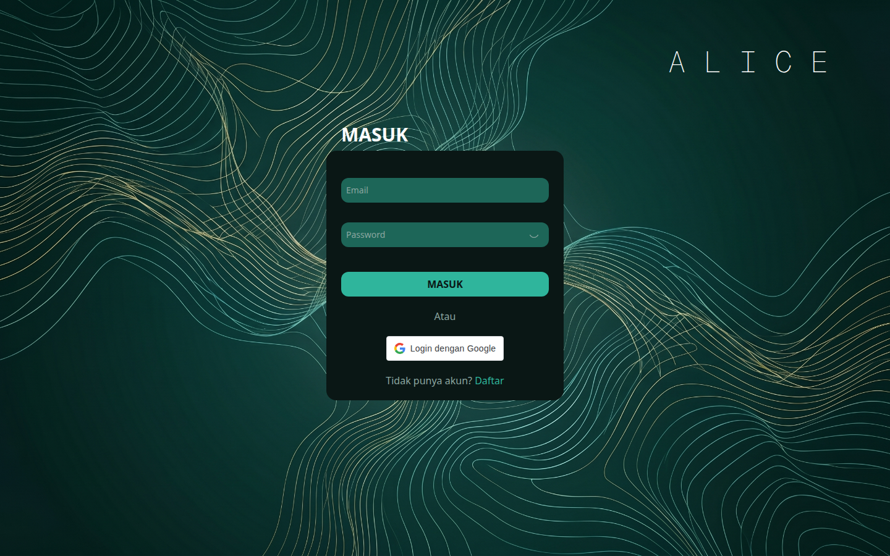

<div align="center">
  
  
  # A.L.I.C.E.
  **Artificial Intelligence for Literacy, Ideal Allocation , and Cost**
  <p><em>Asisten Keuangan Cerdas Berbasis AI Generatif dan Prediktif Machine Learning</em></p>
</div>

---

## 📖 Tentang Proyek
A.L.I.C.E adalah sebuah platform *fintech* revolusioner yang dirancang khusus untuk generasi muda dalam mengelola, menganalisis, dan memprediksi kesehatan finansial mereka. Dengan menggabungkan teknologi Web Modern, Generative AI (LLM), dan Predictive Machine Learning, A.L.I.C.E memberikan panduan keuangan yang sangat terpersonalisasi secara *real-time*.

## ✨ Fitur Utama
- **AI Financial Assistant (Chatbot):** Teman diskusi cerdas yang memahami profil, tujuan finansial, dan riwayat transaksi Anda menggunakan Google Gemini / Llama 3.
- **Budget Optimization:** Menggunakan *Deep Neural Network (DNN)* untuk memberikan rekomendasi alokasi dana ideal agar Anda bisa lebih banyak menabung.
- **Early Warning System (Balance Forecasting):** Menggunakan model LSTM untuk memprediksi saldo 10 hari ke depan, memberi peringatan dini sebelum Anda kehabisan uang.
- **Risk Prediction (Behavioral Nudging):** Mendeteksi transaksi yang berisiko tinggi (Impulsive Buying) dan memberikan peringatan sebelum Anda melakukan transaksi.
- **User Segmentation:** Mengelompokkan kebiasaan belanja (*Konsisten Hemat, Moderat, Impulsif Tinggi*) melalui model Autoencoder.

---

## 🏗️ Arsitektur & Tech Stack
Sistem A.L.I.C.E dibangun menggunakan arsitektur **Microservices** yang canggih:

### 1. 💻 Frontend (Client-side)
- **Framework:** React 19 + Vite
- **Bahasa:** TypeScript
- **Styling:** TailwindCSS v4
- **State/API Management:** TanStack React Query & Axios

### 2. ⚙️ Backend Utama (Orchestrator & Database)
- **Framework:** Node.js + Express
- **Database:** PostgreSQL (menggunakan `pg` & `node-pg-migrate`)
- **Tugas Utama:** Autentikasi, menyimpan profil/riwayat transaksi, dan menyuntikkan *context* finansial secara otomatis ke AI.

### 3. 🤖 AI Chatbot Engine
- **Framework:** Python + FastAPI
- **Model:** Google Gemini (Primary) & Groq / Llama-3 (Fallback)
- **Tugas Utama:** Menangani logika *Prompt Engineering* dinamis berdasarkan data pengguna.

### 4. 🧠 Predictive ML Engine
- **Framework:** Python + FastAPI + Keras/TensorFlow
- **Model:** LSTM, DNN Regressor, Autoencoder, DNN Classifier
- **Tugas Utama:** Menyajikan hasil inferensi data *Machine Learning*.

---

## 📂 Struktur Repositori
```text
main-alice/
├── frontend/           # Kode antarmuka pengguna (React + Vite)
├── backend/            # Gateway & API Server utama (Express + PostgreSQL)
├── alice-chatbot/      # Microservice Chatbot Generatif AI (FastAPI)
├── alice-predicted/    # Microservice Prediksi ML & Forecasting (FastAPI + TensorFlow)
└── README.md           # Dokumentasi proyek
```

---

## 🚀 Cara Menjalankan di Lokal (Development)

Pastikan Anda sudah menginstal **Node.js**, **Python 3.12**, dan **PostgreSQL**.

### 1. Setup Backend
```bash
cd backend
npm install
# Jangan lupa atur .env (copy dari .env.example) dan setup koneksi Database
npm run migrate
npm run start:dev
```

### 2. Setup Frontend
```bash
cd frontend
npm install
# Atur VITE_API_URL di .env
npm run dev
```

### 3. Setup Chatbot (A.L.I.C.E)
```bash
cd alice-chatbot
python -m venv .venv
source .venv/bin/activate # (Untuk Windows: .venv\Scripts\activate)
pip install -r requirements.txt
# Atur GEMINI_API_KEY dan GROQ_API_KEY di .env
uvicorn main:app --reload --port 8001
```

### 4. Setup Predictive ML Engine
```bash
cd alice-predicted
python -m venv .venv
source .venv/bin/activate
pip install -r requirements.txt
uvicorn api.main:app --reload --port 10000
```

---

## 🌐 Panduan Deployment

Berdasarkan ukuran paket dan dukungan teknologi, berikut adalah strategi deployment yang direkomendasikan:

| Microservice | Platform Rekomendasi | Keterangan |
| :--- | :--- | :--- |
| **Frontend** | Vercel | Terintegrasi sempurna dengan Vite |
| **Backend** | Vercel / Render | Node.js Serverless |
| **Chatbot AI** | Vercel | Setup `vercel.json` telah disediakan |
| **Predictive ML** | Render.com | Wajib menggunakan platform berbasis server penuh (Render/Railway/Heroku) karena batas ukuran TensorFlow yang melampaui limit Serverless Vercel (250MB). Setup `render.yaml` telah disediakan. |

---
